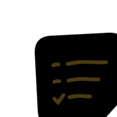
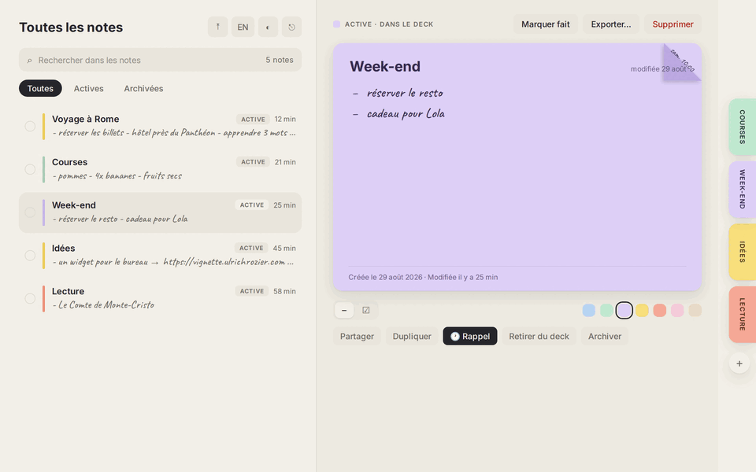
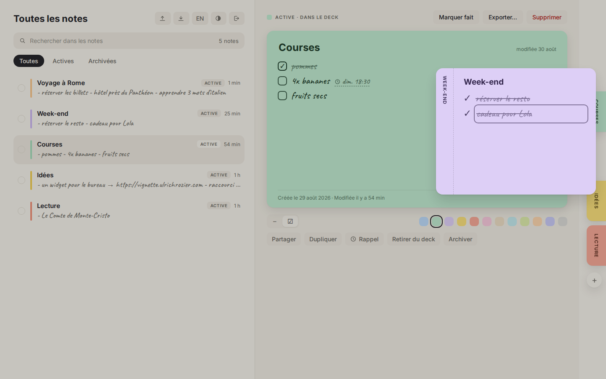
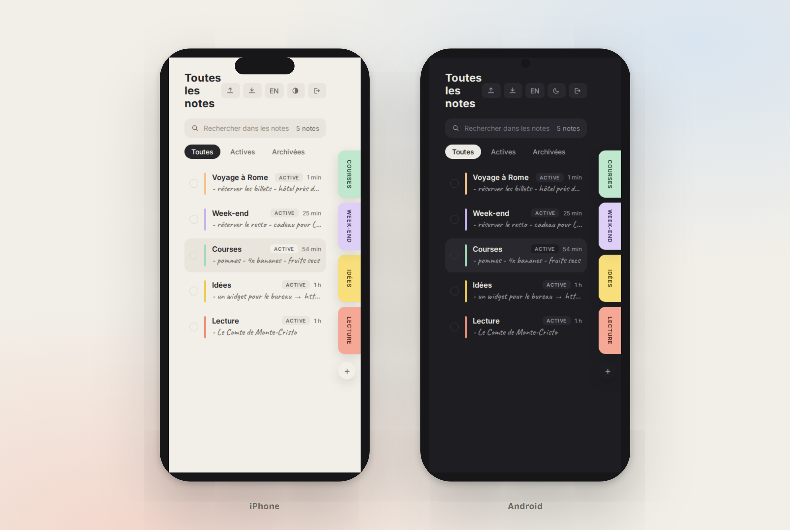

<p align="center">
  
</p>

<h1 align="center">Vignette</h1>

<p align="center">
  <b>Tes listes, collées au bord de l'écran.</b><br>
  Des post-its numériques dockés en onglets pastel, synchronisés en temps réel,
  partageables par email, open source et auto-hébergés.
</p>

<p align="center">
  <a href="https://vignette.ulrichrozier.com">Site & démo</a> ·
  <a href="https://vignette.ulrichrozier.com/telechargements">Téléchargements</a> ·
  <a href="docs/DEMARRER.md">Démarrer</a> ·
  <a href="docs/MODES.md">Les trois modes</a> ·
  <a href="docs/AUTO-HEBERGEMENT.md">Auto-héberger</a> ·
  <a href="docs/PARTAGE.md">Partager</a>
</p>



## Ce que fait Vignette

- **Le deck.** Tes notes vivent en onglets pastel dockés au bord de l'écran et se
  déplient d'une pichenette, avec des animations à ressort. Douze couleurs.
- **Les espaces de travail.** Personnel, Pro, un projet : chaque note appartient
  à un espace, la liste et le deck ne montrent que l'espace actif. Un clic pour
  basculer, zéro mélange.
- **Temps réel.** Coche un item sur ton téléphone, il se barre instantanément sur
  ton Mac (Supabase Realtime, mises à jour optimistes).
- **Partage.** Invite par email en lecture ou en édition ; l'invitation arrive
  comme un petit post-it à accepter ou refuser. La RLS Postgres garantit
  l'isolation entre comptes.
- **Rappels « coin corné ».** Corne une note avec une échéance écrite à la main
  sur le pli, ou griffonne une heure à côté d'un item : l'onglet frémit et une
  notification part quand c'est l'heure, même app fermée (web push).
- **Listes vivantes.** Tirets manuscrits ou cases à cocher, **gras**, *italique*,
  `code` et liens cliquables, duplication, archives, corbeille restaurable avec
  annulation en un clic, exports Markdown/texte, sauvegarde JSON complète.
- **Sur le bureau (desktop).** Épingle une note en vraie fenêtre sans bordure,
  toujours au premier plan, au bord de l'écran ; range-la en onglet quand elle
  gêne. Icône de zone de notifications et raccourci global Ctrl/Cmd+Maj+N pour
  créer une note depuis n'importe où.
- **Mises à jour intégrées.** L'app détecte les nouvelles versions ; sur desktop
  elle se met à jour toute seule (updater signé), ailleurs elle mène au bon
  binaire.
- **FR/EN, clair/sombre, icône au choix.** Français par défaut, mode sombre où
  les post-its restent des post-its, icône d'app déclinable en sept couleurs
  depuis les réglages.
- **Trois modes.** L'instance officielle, la tienne (une URL suffit, l'app
  découvre le reste), ou le mode local pur, sans serveur ni compte ; et une
  migration en un clic du local vers un compte ([docs/MODES.md](docs/MODES.md)).




## Plateformes

| Plateforme | État |
| --- | --- |
| Web (+ PWA installable) | [vignette.ulrichrozier.com/app](https://vignette.ulrichrozier.com/app/) |
| macOS (Apple Silicon) | [dmg](https://vignette.ulrichrozier.com/telechargements) |
| Linux | [AppImage et deb](https://vignette.ulrichrozier.com/telechargements) |
| Android (téléphones, tablettes, pliants) | [APK signé](https://vignette.ulrichrozier.com/telechargements) |
| iOS | build validé en simulateur, distribution à venir |
| Windows | à venir |

Chaque binaire est accompagné de son empreinte SHA-256
([SHA256SUMS.txt](https://vignette.ulrichrozier.com/dl/SHA256SUMS.txt)).

## Architecture

Monorepo pnpm :

| Dossier | Rôle |
| --- | --- |
| `packages/core` | Modèle métier TypeScript pur, testé (Vitest) |
| `apps/web` | Web app React + Vite + Framer Motion (zone membre, `/app`) |
| `apps/site` | Site vitrine statique (racine du domaine) |
| `apps/admin` | Back office (comptes, mots de passe, stats, sauvegardes, `/admin`) |
| `apps/admin-api` | API service-role zéro dépendance (Node), rappels push, découverte d'instance |
| `apps/desktop` | App native Tauri v2 (macOS, Linux, Android ; iOS et Windows à venir) |
| `supabase/` | Stack self-hosted (Postgres + GoTrue + PostgREST + Realtime + Caddy), migrations SQL + RLS |

Le backend est une stack Supabase self-hosted **taillée** : pas de Kong (Caddy
fait le routage et le CORS préflight), pas de Studio ni d'analytics, six
conteneurs, environ 450 Mo de RAM. Le SMTP est totalement optionnel : sans
serveur mail, les comptes marchent immédiatement et les mots de passe se
réinitialisent depuis le back office.

## Démarrer

```bash
git clone https://github.com/Ulrichfr/Vignette-App.git && cd Vignette-App
node supabase/scripts/gen-env.mjs          # secrets (Postgres, JWT, clés)
docker compose -f supabase/docker-compose.yml up -d
./supabase/scripts/apply-migrations.sh     # schéma + RLS
pnpm install && pnpm build                 # web + admin
```

L'app est servie sur `http://127.0.0.1:8360` (site vitrine à la racine, app
membre sur `/app`, back office sur `/admin`). Les inscriptions publiques sont
fermées : crée le premier compte depuis le back office après avoir passé ton
profil en admin (voir [docs/AUTO-HEBERGEMENT.md](docs/AUTO-HEBERGEMENT.md)).

Les apps natives se connectent à ton instance avec sa seule URL : l'app
découvre la configuration toute seule (voir [docs/MODES.md](docs/MODES.md)).

```bash
pnpm test                                  # tests unitaires du modèle
pnpm dev                                   # web app en dev (Vite, port 5183)
node scripts/qa-e2e.mjs                    # 24 scénarios navigateur bout en bout
```

## L'histoire

Vignette est né en une nuit, conçu et construit entièrement avec des agents IA
sur un mini PC auto-hébergé, du premier trait de maquette au binaire signé.
C'est à la fois un vrai outil du quotidien et une démonstration : voir ce qu'on
peut livrer en quelques heures quand on outille bien les agents.

Une nuit, oui. Un prompt, non. Il a fallu un environnement de travail préparé
(machine, accès, sauvegardes, monitoring, plusieurs sessions d'agents qui
coopèrent), un brief clair avec des maquettes et des exigences précises, des
décisions humaines à chaque bifurcation (le nom, la stack, ce qui entre dans la
v1), et un vrai dialogue : tester, renvoyer des retours, réfléchir ensemble à
la suite. L'histoire complète :
[ulrichrozier.com/vignette](https://ulrichrozier.com/vignette).

## Licence

[MIT](LICENSE), fait à la main (enfin, presque), hébergé à la maison.
